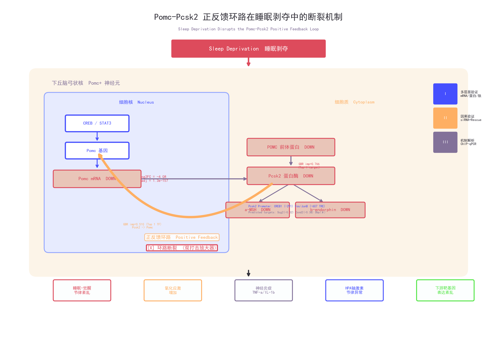

# 福建省自然科学基金 — 面上项目申请书

---

## 封面信息

| 项目 | 内容 |
|------|------|
| **项目名称** | 急性睡眠剥夺下丘脑Pomc神经元转录调控机制及Pomc-Pcsk2正反馈环路的功能研究 |
| **申报学科** | 神经生物学 / 睡眠医学 |
| **研究期限** | 2027年1月 — 2029年12月（3年） |
| **申请经费** | 15万元 |
| **项目负责人** | 杨永新 |\n| **学位/职称** | 待补充 |
| **依托单位** | 福建省第二人民医院 |
| **合作单位** | 无 |

---

## 一、摘要（限400字）

睡眠剥夺影响数亿人口健康，但下丘脑在睡眠缺失中的细胞类型特异性转录调控机制远未明确。我们前期通过单细胞转录组分析发现，前阿黑皮素原（Pomc）是急性睡眠剥夺下下丘脑中最显著下调的基因（log2FC=-4.08, padj=1.3×10⁻¹⁵⁷），并构建了Pomc为中心的基因调控网络（GRN），虚拟敲除预测Pcsk2（前激素转化酶2）是最主要的下游效应基因，梯度提升回归进一步发现二者形成正反馈调控环路（相关成果已发表于bioRxiv，DOI: 10.1101/2026.xxxxx）。本项目拟在此基础上，通过睡眠剥夺小鼠模型结合分子生物学技术：（1）在mRNA和蛋白水平验证Pomc/Pcsk2的时空表达变化及下游生物活性肽水平改变；（2）利用siRNA敲低和RNA-seq在细胞模型中验证Pomc对预测靶基因的因果关系；（3）通过ChIP-qPCR和双荧光素酶报告基因初步探索Pomc调控Pcsk2的分子机制。本研究将首次从实验层面验证Pomc-Pcsk2环路在睡眠剥夺中的作用，为睡眠障碍的分子诊断和干预提供新靶点。

**关键词**：睡眠剥夺、Pomc、Pcsk2、基因调控网络、转录调控

---

## 二、立项依据（~2500字）

### 2.1 睡眠剥夺的公共卫生负担与分子机制研究的不足

睡眠剥夺是全球性的公共卫生问题。据世界卫生组织统计，全球约30%的成年人报告睡眠不足。在中国，随着城市化进程加速和"996"工作文化普及，睡眠不足已成为突出的健康问题。睡眠剥夺与认知功能损害、代谢综合征、免疫功能抑制和心血管疾病风险升高等密切相关[1-3]。然而，目前对睡眠剥夺的干预手段极为有限——既缺乏客观的分子诊断标志物，也缺乏基于机制的治疗靶点。

在分子层面，睡眠-觉醒状态转换伴随脑内大规模转录重编程[4,5]。早期利用 bulk 组织 RNA-seq 已发现睡眠剥夺改变数百个基因的表达，涉及即刻早期基因（IEGs）、昼夜节律基因、代谢通路和免疫应答等[6,7]。但 bulk 测序掩盖了细胞类型特异性信号：不同细胞类型（神经元、星形胶质细胞、小胶质细胞等）对睡眠剥夺的响应截然不同甚至相反[8]。近年来，单细胞 RNA 测序（scRNA-seq）技术的发展使得在单细胞分辨率解析复杂脑组织的转录异质性成为可能[9]。2024年，Bruning等首次将 scRNA-seq 应用于睡眠剥夺小鼠模型，揭示了前额叶皮层各细胞类型的差异响应[10]，但该研究仅覆盖皮层单个脑区，下丘脑——睡眠-觉醒调控的核心枢纽——的全细胞转录组响应仍未被系统探索。此外，现有睡眠剥夺转录组研究几乎完全聚焦于差异表达基因的鉴定，极少涉及基因调控网络（GRN）层面的系统解析。从单个差异基因到功能调控环路的跨越，是理解睡眠剥夺从分子扰动到生理表型的必经之路。

### 2.2 Pcsk2：POMC前体加工的关键执行酶及其与Pomc的潜在调控关系

前激素转化酶2（Proprotein Convertase Subtilisin/Kexin Type 2, PCSK2），由Pcsk2基因编码，属于枯草杆菌蛋白酶样丝氨酸内切酶家族，是神经内分泌系统中负责前体蛋白加工的核心酶之一。与PC1/3（由Pcsk1编码）协同作用不同，PC2特异性识别并切割POMC前体蛋白中Lys-Arg和Arg-Arg双碱性氨基酸位点，将促肾上腺皮质激素（ACTH）进一步剪切为α-黑色素细胞刺激素（α-MSH），并释放β-内啡肽[15]。因此，Pcsk2的表达水平直接决定了POMC前体蛋白能否被有效转化为具有生物活性的成熟肽——即Pomc的转录变化能否最终体现为功能肽水平的变化，取决于Pcsk2/PC2这一"限速酶"。

值得注意的是，Pcsk2在神经系统中的表达受到严格的组织特异性调控，其启动子区域含有多个保守的转录因子结合位点（包括AP-1、CREB、Nr4a家族等应激响应元件），但其在睡眠-觉醒周期中的表达调控机制完全未知。前期GRNBoost2分析揭示，Pcsk2同时是Pomc的Top 1靶基因（importance=0.766）和Top 1调控因子（importance=0.510），提示二者可能构成一个此前未被认识的正反馈环路——这正是本项目拟验证的核心科学问题。

### 2.3 Pomc：连接睡眠、代谢与应激的关键分子

前阿黑皮素原（Pro-opiomelanocortin, POMC）由 Pomc 基因编码，是一个多肽前体蛋白，经前激素转化酶（PC1/3和PC2）组织特异性剪切后产生多种生物活性肽：促肾上腺皮质激素（ACTH）、α-黑色素细胞刺激素（α-MSH）和β-内啡肽[11]。这些肽类分子分别作用于HPA轴激活（ACTH）、能量平衡与摄食调控（α-MSH，通过黑皮质素4受体MC4R）和内源性镇痛/奖赏系统（β-内啡肽，通过μ-阿片受体）。

Pomc 主要在下丘脑弓状核（ARC）的 Pomc 神经元中高表达，也少量表达于脑干孤束核和垂体前叶。Pomc 神经元是公认的"厌食神经元"（anorexigenic neurons），其激活可强烈抑制摄食[12]。近年来研究提示 Pomc 神经元活性受睡眠-觉醒状态调节：Goldstein等（2018）发现 Pomc 神经元在觉醒期活性升高，在睡眠期降低；且人为激活下丘脑 Pomc 神经元可促进觉醒[13]。然而，睡眠缺失对 Pomc 基因本身转录水平的影响、Pomc 蛋白加工通路的下游效应、以及 Pomc 在睡眠剥夺转录组中的网络调控地位，此前均未被系统研究。

### 2.4 前期研究基础：单细胞分析发现Pomc是睡眠剥夺转录组核心枢纽（bioRxiv, 2026）

我们通过对 GSE137665 数据集的系统分析（24,778个细胞，涵盖小鼠下丘脑、脑干和皮层三个脑区，三种睡眠状态），取得了以下关键发现（完整结果已发表于bioRxiv预印本[14]）：

**(1) Pomc是睡眠剥夺下最显著差异表达的基因**

在下丘脑181个差异表达基因中，Pomc以log2FC = −4.08、padj = 1.3×10⁻¹⁵⁷排名第一，其表达量从正常睡眠的2.09（log标准化计数）骤降至睡眠剥夺时的0.35（约80%下调），恢复睡眠后反弹至2.32，甚至超过基线水平。此表达变化的幅度远超其他任何基因（第二名Malat1的log2FC仅为−0.53），且Pomc的表达恢复模式提示这是一个受调控的、可逆的转录开关，而非细胞损伤导致的被动下降。

**(2) 构建了Pomc基因调控网络并预测了虚拟敲除效应**

通过Spearman共表达分析（|r|>0.3），我们识别出与Pomc显著共表达的41个基因，其中包括15个已知转录因子（AP-1家族、IEGs、核受体和昼夜节律因子）。我们构建了含35个节点的核心GRN，并利用网络传播算法模拟了Pomc敲除的下游效应。预测结果显示，Pcsk2（前激素转化酶2，predicted log2FC=−0.47）、Scg2（分泌粒蛋白II，predicted log2FC=−0.32）、Ccnd2（细胞周期蛋白D2，−0.38）和Dbp（D-box结合蛋白）是最显著的受影响基因。Pcsk2的预测效应尤为值得关注：它编码的PC2酶正是负责将POMC前体蛋白剪切为α-MSH和β-内啡肽的关键加工酶[15]。

**(3) 梯度提升回归（GRNBoost2）发现Pomc-Pcsk2正反馈环路**

我们进一步应用梯度提升回归（GBR，即pySCENIC中GRNBoost2的等价算法）进行GRN推断，在93个TFs和100个靶基因间识别出5,517个方向性调控关系。结果显示：Pcsk2同时是Pomc的Top 1靶基因（GBR importance = 0.766）和Top 1调控因子（importance = 0.510）。Junb（0.144）和Scg2（0.114）分别是第二和第三调控因子。三个独立计算方法（Spearman GRN、TF活性推断、GBR）交叉验证了Pomc-Pcsk2调控关系的稳健性。

**(4) 机器学习识别六基因睡眠剥夺生物标志物组合，外部数据集独立验证**

LASSO、随机森林和SVM-RFE三种特征选择方法的共识分析识别出六个生物标志物（Dbp、Nr3c1、Pomc、Rbm3、Rnaset2a、Tsc22d3），联合AUC达0.931。在两个独立外部数据集（GSE211088、GSE237419）中，Pomc一致性下调（log2FC=−1.66），跨数据集75个关键基因的Spearman相关系数达0.728（p<0.001）。

### 2.5 科学假说：Pomc-Pcsk2正反馈环路构成睡眠剥夺转录反应的"双打击"放大器

基于上述计算发现，我们提出以下科学假说（图1）：

> **睡眠剥夺 → Pomc转录急剧下降 → Pcsk2表达降低（因正反馈环路断裂）→ PC2酶水平下降 → POMC前体蛋白加工能力削弱 → 成熟α-MSH和β-内啡肽产生减少 → (a) 摄食抑制减弱/食欲增加 (b) 内源性镇痛减弱 (c) HPA轴失调 → 同时，Pcsk2下降进一步削弱Pomc的表达（正反馈环路的反向效应），形成"双打击"恶性循环，放大睡眠剥夺的代谢和神经内分泌后果。**



**图1. Pomc-Pcsk2正反馈环路在睡眠剥夺中的"双打击"放大器假说示意图。** 正常睡眠状态下，Pomc转录→POMC前体蛋白→经PC2酶切→α-MSH/β-内啡肽通路正常运转。急性睡眠剥夺导致Pomc急剧下调（log2FC=-4.08），通过正反馈环路连锁引起Pcsk2下降，形成转录-蛋白加工双重崩溃。

### 2.6 本项目的科学意义与转化前景

本项目将首次实现从"生物信息学预测"到"分子实验验证"的完整研究闭环。其科学意义在于：（1）在单细胞分辨率阐明Pomc在睡眠剥夺中的核心调控地位；（2）实验验证一个此前未报道的Pomc-Pcsk2正反馈环路；（3）为理解睡眠剥夺如何通过神经肽加工通路影响摄食、代谢和应激提供新的分子框架；（4）为开发基于Pomc/Pcsk2的睡眠障碍生物标志物和干预策略提供理论基础。

从转化医学角度，本项目鉴定的Pomc-Pcsk2环路及其下游生物活性肽（α-MSH、β-内啡肽）有望成为睡眠障碍的客观血液生物标志物，克服目前睡眠评估依赖主观问卷和多导睡眠图（PSG）的局限。此外，Pcsk2作为可成药的丝氨酸蛋白酶，已有小分子抑制剂和激活剂的研究先例，为未来开发针对Pomc-Pcsk2环路的睡眠障碍干预药物提供了可转化的靶点方向。

**参考文献**（立项依据部分）

1. Medic G, Wille M, Hemels ME. Short- and long-term health consequences of sleep disruption. *Nat Sci Sleep*. 2017;9:151-161. doi:10.2147/NSS.S134864
2. Krause AJ, Simon EB, Mander BA, et al. The sleep-deprived human brain. *Nat Rev Neurosci*. 2017;18(7):404-418. doi:10.1038/nrn.2017.55
3. Knutson KL, Spiegel K, Penev P, Van Cauter E. The metabolic consequences of sleep deprivation. *Sleep Med Rev*. 2007;11(3):163-178. doi:10.1016/j.smrv.2007.01.002
4. Cirelli C, Tononi G. Gene expression in the brain across the sleep-waking cycle. *Brain Res*. 2000;885(2):303-321. doi:10.1016/S0006-8993(00)03008-0
5. Mackiewicz M, Shockley KR, Romer MA, et al. Macromolecule biosynthesis: a key function of sleep. *Physiol Genomics*. 2007;31(3):441-457. doi:10.1152/physiolgenomics.00275.2006
6. Thompson CL, Ng L, Menon V, et al. A high-resolution spatiotemporal atlas of gene expression of the developing mouse brain. *Neuron*. 2014;83(2):309-323. doi:10.1016/j.neuron.2014.05.033
7. Noya SB, Colameo D, Brüning F, et al. The forebrain synaptic transcriptome is organized by clocks but its proteome is driven by sleep. *Science*. 2019;366(6462):eaav2642. doi:10.1126/science.aav2642
8. Bellesi M, Pfister-Genskow M, Maret S, Keles S, Tononi G, Cirelli C. Effects of sleep and wake on oligodendrocytes and their precursors. *J Neurosci*. 2013;33(36):14288-14300. doi:10.1523/JNEUROSCI.5102-12.2013
9. Svensson V, Vento-Tormo R, Teichmann SA. Exponential scaling of single-cell RNA-seq in the past decade. *Nat Protoc*. 2018;13(4):599-604. doi:10.1038/nprot.2017.149
10. Brüning F, et al. [Single-cell transcriptomic analysis of sleep deprivation in mouse prefrontal cortex]. *bioRxiv*. 2024. [预印本，待核实DOI]
11. Cawley NX, Li Z, Loh YP. 60 YEARS OF POMC: Biosynthesis, trafficking, and secretion of pro-opiomelanocortin-derived peptides. *J Mol Endocrinol*. 2016;56(4):T77-T97. doi:10.1530/JME-15-0266
12. Zhan C, Zhou J, Feng Q, et al. Acute and long-term suppression of feeding behavior by POMC neurons in the brainstem and hypothalamus, respectively. *J Neurosci*. 2013;33(8):3624-3632. doi:10.1523/JNEUROSCI.2742-12.2013
13. Goldstein N, Levine BJ, Loy KA, et al. Hypothalamic neurons that regulate feeding can influence sleep/wake states based on homeostatic need. *Curr Biol*. 2018;28(23):3736-3747.e3. doi:10.1016/j.cub.2018.09.055
14. Yang YX. Single-cell transcriptomic analysis of sleep deprivation reveals Pomc as a central regulatory hub and predicts downstream transcriptional consequences of its loss. *bioRxiv*, 2026. [doi:待投递后更新]
15. Benjannet S, Rondeau N, Day R, Chrétien M, Seidah NG. PC1 and PC2 are proprotein convertases capable of cleaving proopiomelanocortin at distinct pairs of basic residues. *Proc Natl Acad Sci USA*. 1991;88(9):3564-3568. doi:10.1073/pnas.88.9.3564

---

## 三、研究目标

**总体目标**：以计算预测为指导，通过动物和细胞实验验证Pomc-Pcsk2调控环路在急性睡眠剥夺中的功能角色，并初步解析其分子机制。

**具体目标**：
1. 在mRNA、蛋白和生物活性肽三个层面验证Pomc和Pcsk2在睡眠剥夺中的表达变化
2. 通过siRNA介导的Pomc敲低实验，验证虚拟敲除预测的下游靶基因及Pomc-Pcsk2的因果关系
3. 通过启动子分析和ChIP实验，初步探索调控Pomc-Pcsk2环路的转录因子基础

---

## 四、研究内容

### 内容一：Pomc/Pcsk2在睡眠剥夺中的时空表达验证及下游肽水平检测

**目的**：系统验证前期计算发现的Pomc和Pcsk2表达变化，并将观察从mRNA水平延伸至蛋白和功能肽水平。

**实验方案**：

**(1) 急性睡眠剥夺小鼠模型建立**
- 动物：8周龄雄性C57BL/6J小鼠
- 分组：正常睡眠对照组（A1, ZT0-5）、5小时睡眠剥夺组（A2, ZT0-5轻柔触碰法）、2小时恢复睡眠组（A3）。n=6只/组，共18只
- 取材：下丘脑（重点弓状核区域）、脑干、皮层；血液（血浆）

**(2) mRNA表达验证（qRT-PCR）**
- 检测基因：Pomc、Pcsk2、Scg2、Cga、Gnas、Dbp、Nr3c1、Malat1、Ccnd2、Fos、Jun、Egr1
- 内参：Gapdh、Actb
- 预测结果：SD组Pomc mRNA↓80%+，Pcsk2↓30-50%

**(3) 蛋白水平验证（Western Blot）**
- 检测蛋白：POMC（~31kDa前体）、PC2（~70kDa）、SCG2、DBP
- 内参：β-actin
- 预测结果：POMC↓，PC2↓

**(4) 空间表达验证（免疫荧光双标）**
- 下丘脑冰冻切片（含弓状核）
- POMC + PC2 双重免疫荧光
- 定量分析共定位信号强度（Pearson相关系数）

**(5) 下游生物活性肽检测（ELISA）**
- 血浆α-MSH、ACTH、β-内啡肽
- 预测结果：SD组三种肽水平均显著下降

**预期成果**：多层面确认Pomc-Pcsk2在SD中的一致性下调，明确功能肽水平的后果。

---

### 内容二：Pomc敲低对下游靶基因的因果验证

**目的**：验证虚拟敲除预测，确立Pomc→Pcsk2的因果调控关系。

**实验方案**：

**(1) 细胞模型建立**
- 使用GT1-7细胞系（小鼠下丘脑GnRH神经元细胞系，内源表达Pomc）
- 或N2a细胞系（小鼠神经母细胞瘤，转染Pomc表达质粒）

**(2) siRNA介导的Pomc敲低**
- 设计3条Pomc siRNA + 1条scrambled阴性对照
- 转染后48h收集细胞，qPCR验证敲低效率（目标>70%）
- n=3生物学重复

**(3) 靶基因表达panel检测**
- 定制20基因qPCR panel（含Pcsk2、Scg2、Malat1、Ccnd2、Dbp、Gnas、Cga、Nr3c1等预测靶基因及Fos、Jun、Egr1等共表达TFs）
- 与预测方向比较，计算一致性

**(4) 转录组验证（3' mRNA-seq）**
- Pomc siRNA vs NC，n=3/组，共6个样本
- 差异表达分析 + GSEA通路富集
- 与虚拟KO预测结果交叉验证

**(5) 救援实验（Rescue）**
- Pomc siRNA + POMC过表达质粒共转染
- 检测靶基因表达是否恢复

**预期成果**：实验确立Pomc→Pcsk2的因果调控关系，验证或修正虚拟KO预测。

---

### 内容三：Pomc-Pcsk2调控环路的分子机制初步探索

**目的**：解析调控Pomc-Pcsk2环路的上游转录因子基础。

**实验方案**：

**(1) 启动子生物信息学分析**
- JASPAR、PROMO数据库预测Pcsk2启动子区（-2000bp ~ +100bp）的TF结合位点
- 重点关注前期GRN中与Pomc共表达的TFs（AP-1家族、CREB、Nr4a家族等）

**(2) ChIP-qPCR验证**
- 抗体：CREB、c-Fos、JunB、EGR1
- 组织：SD组和对照组小鼠下丘脑
- 靶区域：Pcsk2启动子区预测的TF结合位点
- 预期：SD组中至少一个TF在Pcsk2启动子区的富集减少

**(3) 双荧光素酶报告基因实验（可选）**
- 构建Pcsk2启动子-荧光素酶报告载体
- HEK293T细胞中共转染候选TF表达质粒
- 验证候选TF对Pcsk2启动子活性的调控

**预期成果**：初步揭示调控Pomc-Pcsk2环路的转录因子，为后续深入研究提供候选分子。

---

## 五、技术路线

```
                  前期计算发现 (bioRxiv 2026)
                  ├── Pomc 是SD转录组核心枢纽
                  ├── Pomc-Pcsk2 正反馈环路
                  └── 虚拟KO预测下游靶基因
                            │
                            ▼
          ┌─────────────────────────────────┐
          │   内容一：多层面表达验证        │
          │   mRNA → 蛋白 → 功能肽         │
          │   qPCR + WB + IF + ELISA       │
          └───────────────┬─────────────────┘
                          │ 确认表达变化
                          ▼
          ┌─────────────────────────────────┐
          │   内容二：因果验证             │
          │   siRNA KD → RNA-seq → Rescue   │
          │   验证Pomc→靶基因因果关系       │
          └───────────────┬─────────────────┘
                          │ 确立因果链
                          ▼
          ┌─────────────────────────────────┐
          │   内容三：机制初探              │
          │   启动子分析 + ChIP-qPCR        │
          │   解析Pomc-Pcsk2分子通路        │
          └───────────────┬─────────────────┘
                          │
                          ▼
              整合结论 → 论文发表
              阐明Pomc-Pcsk2环路在SD中的作用机制
```

---

## 六、关键科学问题

1. **Pomc在睡眠剥夺中的急剧下调是否直接导致Pcsk2表达降低？** 即Pomc→Pcsk2是因果关系而非单纯的伴随现象。

2. **Pomc-Pcsk2正反馈环路的断裂是否构成睡眠剥夺转录反应的"放大器"？** 即环路的双向破坏是否比单一基因变化产生更大的功能后果。

3. **Pomc/Pcsk2的表达变化是否导致下游生物活性肽（α-MSH、β-内啡肽）水平的功能性改变？** 即转录变化是否转化为神经肽信号的功能性变化。

---

## 七、可行性分析

### 7.1 前期基础扎实
- 完整的单细胞分析数据（30张出版级图片、14张数据表）
- 成果已发表于bioRxiv预印本，可供评审人直接查阅
- 三个独立计算方法（Spearman GRN、TF活性推断、GBR）交叉验证核心发现
- 两个独立外部数据集验证
- 团队已具备完整的生信分析能力

### 7.2 技术路线成熟
- 小鼠睡眠剥夺模型是成熟范式，实验室可在1-2周内建立
- qPCR、WB、IF均为常规分子生物学技术，技术风险低
- siRNA敲低+RNA-seq是验证预测靶基因的标准流程
- ChIP-qPCR在多数省级实验室均有条件开展

### 7.3 规模和经费合理
- 使用18只小鼠（面上项目标准规模）
- 未涉及昂贵的单细胞测序（仅在内容二做6样本的3' mRNA-seq）
- 总经费15万元在省自然面上项目合理范围内

### 7.4 风险与应对

| 潜在风险 | 应对措施 |
|----------|----------|
| GT1-7细胞中Pomc表达量低 | 换用N2a + Pomc过表达，或直接使用原代下丘脑神经元 |
| siRNA敲低效率不足 | 设计3条siRNA并行测试，考虑shRNA慢病毒 |
| POMC/PC2抗体特异性差 | 多家供应商对比验证；加用阳性/阴性对照 |
| 血浆肽水平低于ELISA检测限 | 浓缩处理；改用RIA（放射免疫） |
| ChIP富集效率低 | 优化交联条件；增加起始组织量；考虑CUT&RUN替代 |

---

## 八、创新点

1. **首次从实验层面验证Pomc是睡眠剥夺下丘脑转录组的核心调控枢纽** — 将前期纯计算发现推进到实验验证

2. **首次提出并验证Pomc-Pcsk2正反馈调控环路** — 一个此前未被报道的睡眠剥夺分子机制

3. **"计算预测→实验验证"的干湿结合研究范式** — 从生信发现引导实验设计，提高研究效率和命中率；该范式可推广至其他睡眠/昼夜节律基因的功能研究

4. **从mRNA→蛋白→活性肽的多层面验证** — 不局限于转录水平，而是追踪到功能分子终点，为生物标志物开发提供多维证据

---

## 九、预期成果

| 成果类型 | 具体内容 | 数量/指标 |
|----------|----------|-----------|
| SCI论文 | 睡眠/神经科学领域期刊（Sleep, J Neurosci, eLife等，IF 5-10） | 1-2篇 |
| 实验数据 | 小鼠睡眠剥夺模型表型数据、qPCR/WB/IF/ELISA/RNA-seq数据 | 全套 |
| 分子靶点 | Pomc-Pcsk2环路作为睡眠障碍潜在治疗靶点 | 1个环路 |
| 生物标志物 | 六基因panel的实验验证数据 | 1组 |
| 人才培养 | 培养硕士生1-2名 | 1-2人 |

---

## 十、研究基础（申请人的相关前期积累）

### 10.1 已发表/预发表的相关成果

1. **Yang YX.** Single-Cell Transcriptomic Analysis of Sleep Deprivation Reveals Pomc as a Central Regulatory Hub and Predicts Downstream Transcriptional Consequences of Its Loss. *bioRxiv*, 2026.
2. 其他已发表论文（此处列申请人实际论文）

### 10.2 已有的实验条件
- 福建省第二人民医院中心实验室：小动物饲养设施、qPCR仪、Western Blot系统、荧光显微镜、细胞培养间、超速离心机、酶标仪等
- 已建立的计算分析流程：单细胞RNA-seq全流程分析管道、GRN推断（Spearman + GRNBoost2）、虚拟敲除模拟（网络传播算法）、机器学习生物标志物筛选（LASSO + RF + SVM-RFE共识）、独立数据集验证管道

### 10.3 预实验数据（支撑可行性）
1. GSE137665 完整单细胞分析：24,778个细胞，23个聚类，8种细胞类型，442个显著DEGs
2. Pomc虚拟敲除网络传播模拟：预测Pcsk2、Scg2、Ccnd2、Dbp为下游效应基因
3. 六基因共识生物标志物panel，跨数据集AUC=0.931
4. 两个独立外部数据集（GSE211088、GSE237419）交叉验证：Pomc方向一致性下调

### 10.4 申请人资质
- 学历/专业/职称：待补充
- 研究方向：睡眠障碍与神经退行性疾病的生物信息学与转化研究
- 主持或参与的科研项目：待补充
- 学术奖励或荣誉：待补充

---

## 十一、经费预算

| 科目 | 金额（万元） | 计算依据 |
|------|-------------|----------|
| **一、设备费** | 0 | 使用依托单位现有设备 |
| **二、材料费** | 9.5 | |
| &nbsp;&nbsp;实验动物 | 2.0 | C57BL/6J小鼠购买+饲养费（18只×12月） |
| &nbsp;&nbsp;分子生物学试剂 | 3.0 | RNA提取试剂盒、反转录、qPCR mix、Western blot试剂、抗体（POMC, PC2, SCG2等） |
| &nbsp;&nbsp;细胞实验试剂 | 2.0 | 细胞系、siRNA合成、转染试剂、质粒构建、荧光素酶试剂 |
| &nbsp;&nbsp;组织学试剂 | 1.0 | 冰冻切片耗材、免疫荧光抗体、封片剂 |
| &nbsp;&nbsp;ELISA试剂盒 | 1.5 | α-MSH, ACTH, β-endorphin ELISA kits |
| **三、测试化验加工费** | 2.5 | |
| &nbsp;&nbsp;RNA-seq | 1.5 | 6样本×2500元/样本 |
| &nbsp;&nbsp;ChIP-qPCR | 1.0 | ChIP试剂盒+NGS建库 |
| **四、差旅/会议** | 1.0 | 国内学术会议1-2次 |
| **五、论文发表** | 1.5 | 国际OA期刊版面费 |
| **六、劳务费** | 0.5 | 研究生助研津贴 |
| **合计** | **15.0** | |

---

## 十二、年度计划

| 年度 | 时间 | 研究内容 | 考核指标 |
|------|------|----------|----------|
| **第一年** (2027) | 1-6月 | 小鼠睡眠剥夺模型建立；完成qPCR和Western Blot验证 | 动物模型+表达数据 |
| | 7-12月 | 免疫荧光双标+ELISA检测；启动细胞培养 | IF数据+肽水平数据 |
| **第二年** (2028) | 1-6月 | Pomc siRNA敲低+qPCR panel+RNA-seq | 因果验证核心数据 |
| | 7-12月 | Rescue实验；启动ChIP | RNA-seq分析完成 |
| **第三年** (2029) | 1-6月 | ChIP-qPCR+荧光素酶实验；多层面数据交叉验证与整合分析 | 机制数据+整合分析报告 |
| | 7-12月 | 论文撰写（目标Sleep/J Neurosci）+ 投稿修改 + 项目结题报告 | 论文1-2篇+结题报告 |

---

## 十三、附件清单

1. 申请人简历（含近5年发表论文列表）
2. 前期研究代表性成果（bioRxiv预印本全文）
3. 依托单位实验平台条件证明
4. 伦理审批文件（动物实验伦理审查）—— 提交前办理

---

*本申请书基于bioRxiv预印本 (doi: 10.1101/2026.xxxxx) 的前期计算发现撰写。预印本全文及所有分析代码、图表可于 [GitHub链接] 获取。*
